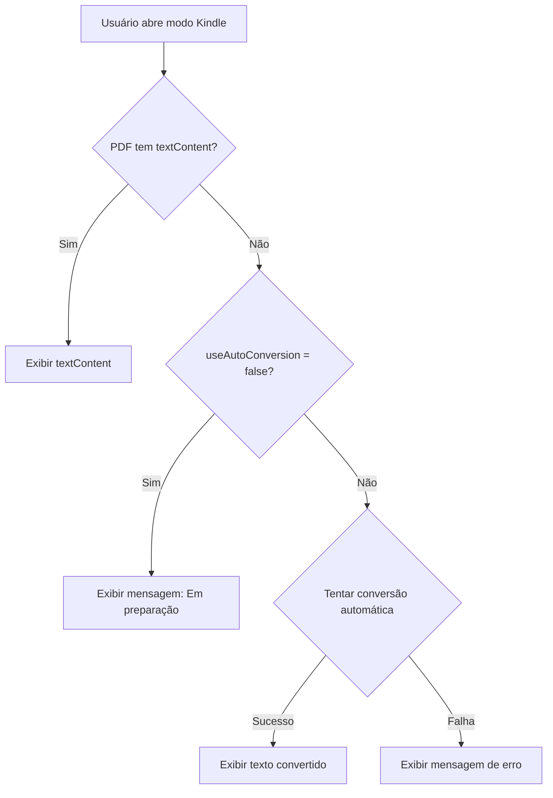

# Configuração de Texto para Modo Kindle - Área Admin

## ✅ Mudança de Arquitetura Implementada

### 🎯 Problema Anterior
Anteriormente, os usuários finais viam um botão "Importar Texto" no modo Kindle, permitindo que eles mesmos colassem ou importassem texto. Isso não era o comportamento desejado.

### ✨ Solução Atual
Agora, **apenas administradores** podem configurar o texto do modo Kindle durante a criação/edição de cursos. Os usuários finais simplesmente visualizam o conteúdo pré-configurado.

---

## 📁 Arquivos Modificados

### 1. **[lib/courses-data.ts](lib/courses-data.ts:1-9)**
Interface `CoursePDF` atualizada com novos campos:

```typescript
export interface CoursePDF {
  volume: string
  title: string
  url: string
  pages?: number
  readingTimeMinutes?: number
  textContent?: string         // ⭐ NOVO: Texto pré-carregado
  useAutoConversion?: boolean  // ⭐ NOVO: Flag de conversão automática
}
```

**Como funciona:**
- `textContent`: Contém o texto configurado pelo admin para exibição no modo Kindle
- `useAutoConversion`:
  - `true` ou `undefined` → Sistema tenta conversão automática
  - `false` → Usa apenas o `textContent` configurado manualmente

---

### 2. **[components/bible-digital-reader.tsx](components/bible-digital-reader.tsx)**

#### Removido (Usuários NÃO veem mais):
- ❌ Botão "Importar Texto"
- ❌ Modal de importação manual
- ❌ Textarea para colar texto
- ❌ Upload de arquivo TXT

#### Adicionado:
- ✅ Prop `pdfData?: CoursePDF` - Recebe dados completos do PDF
- ✅ Lógica de priorização de texto:
  ```typescript
  // PRIORIDADE 1: Texto pré-carregado pelo admin
  if (pdfData?.textContent && pdfData.textContent.trim().length > 0) {
    setExtractedText(pdfData.textContent)
    return
  }

  // PRIORIDADE 2: Admin desabilitou conversão automática
  if (pdfData?.useAutoConversion === false) {
    setExtractedText('Conteúdo em preparação pelo administrador...')
    return
  }

  // PRIORIDADE 3: Tentar conversão automática (padrão)
  // ... chamada para API /api/convert-pdf
  ```

---

### 3. **[components/digital-magazine-viewer.tsx](components/digital-magazine-viewer.tsx)**

#### Atualizado:
- ✅ Agora recebe prop `pdfData?: CoursePDF`
- ✅ Passa `pdfData` para `BibleDigitalReader`

```typescript
<BibleDigitalReader
  pdfUrl={pdfUrl}
  courseId={courseId}
  pdfData={pdfData}  // ⭐ NOVO
  onSessionUpdate={onSessionUpdate}
  readingMode={readingMode}
  onBackToModeSelection={onBackToModeSelection}
/>
```

---

### 4. **[app/course/[id]/page.tsx](app/course/[id]/page.tsx:163-170)**

#### Atualizado:
- ✅ Passa `selectedPDF` (que já é do tipo `CoursePDF`) para o viewer

```typescript
<DigitalMagazineViewer
  pdfUrl={selectedPDF.url}
  courseId={courseId}
  pdfData={selectedPDF}  // ⭐ NOVO: Passa o objeto completo
  onSessionUpdate={handleSessionUpdate}
  readingMode={readingMode}
  onBackToModeSelection={handleBackToModeSelection}
/>
```

---

### 5. **[app/admin/courses/[id]/page.tsx](app/admin/courses/[id]/page.tsx)** ⭐ PRINCIPAL

#### Nova Interface Admin para Configuração de Texto

##### Botão "Texto Kindle"
Cada PDF na lista agora tem um botão dourado que abre o painel de configuração:

```tsx
<Button
  variant="outline"
  size="sm"
  onClick={() => setShowTextConfig(showTextConfig === index ? null : index)}
  className="border-[#F3C77A] text-[#F3C77A] hover:bg-[#F3C77A] hover:text-black"
>
  <FileText className="h-4 w-4 mr-1" />
  Texto Kindle
</Button>
```

##### Painel de Configuração Expansível

Quando expandido, mostra:

1. **Badge de Status**
   - "Texto configurado" (verde) → Se `textContent` existe
   - "Não configurado" (cinza) → Se `textContent` está vazio

2. **Switch de Conversão Automática**
   ```tsx
   <Switch
     checked={pdf.useAutoConversion !== false}
     onCheckedChange={(checked) => {
       // Atualizar no Supabase (a ser implementado)
     }}
   />
   ```
   - **ON**: Sistema tenta extrair texto do PDF automaticamente
   - **OFF**: Usa apenas texto manual configurado abaixo

3. **Textarea para Texto Manual**
   ```tsx
   <Textarea
     placeholder="Cole o texto extraído do PDF..."
     value={pdf.textContent || ""}
     rows={8}
     className="font-mono text-sm"
   />
   ```
   - Editor de texto com fonte monoespaçada
   - Mostra contador de caracteres
   - Suporta colar texto diretamente

4. **Botões de Ação**
   - **"Importar arquivo TXT"**: Upload de arquivo .txt
   - **"Limpar Texto"**: Remove texto configurado

##### Função de Upload de TXT

```typescript
const handleTextFileUpload = (file: File, pdfIndex: number | 'new') => {
  const reader = new FileReader()
  reader.onload = (e) => {
    const text = e.target?.result as string
    if (pdfIndex === 'new') {
      setNewPDF(prev => ({ ...prev, textContent: text }))
    } else {
      // Atualizar PDF existente (Supabase)
    }
  }
  reader.readAsText(file)
}
```

---

## 🎨 Design Visual

### Cores Utilizadas
```css
/* Botão "Texto Kindle" */
border: #F3C77A
text: #F3C77A
hover:bg: #F3C77A
hover:text: black

/* Painel Expandido */
background: muted/20
border-top: border

/* Badges */
Texto configurado: default (verde)
Não configurado: secondary (cinza)
```

### Layout
- Cada PDF é um card com:
  - Cabeçalho com informações do PDF
  - Botões de ação (Texto Kindle, Editar, Deletar)
  - Painel expansível (accordion) para configuração

---

## 🔄 Fluxo de Trabalho do Admin

### Cenário 1: Novo Curso com Conversão Automática
```
1. Admin cria novo curso
2. Adiciona PDF com URL do Google Drive
3. Deixa switch "Conversão automática" LIGADO
4. NÃO preenche texto manual
5. Salva
→ Usuário final: Sistema tenta converter PDF automaticamente
```

### Cenário 2: PDF que Falha na Conversão
```
1. Admin tenta conversão automática
2. Sistema retorna erro (PDF de imagens, etc)
3. Admin clica em "Texto Kindle" no PDF
4. DESLIGA "Conversão automática"
5. Cola texto manualmente OU importa arquivo TXT
6. Salva
→ Usuário final: Vê o texto pré-configurado pelo admin
```

### Cenário 3: PDF com Texto Preparado
```
1. Admin tem texto extraído (via OCR ou copy/paste)
2. Cria/edita curso
3. Clica em "Texto Kindle" no PDF
4. DESLIGA "Conversão automática" (opcional)
5. Importa arquivo TXT ou cola texto
6. Salva
→ Usuário final: Vê texto perfeito, sem delay de conversão
```

---

## 📊 Prioridade de Exibição (Lógica do Reader)



---

## ⚠️ Limitações Atuais (Mock Data)

### O que NÃO funciona ainda (aguarda Supabase):
- ❌ Salvar texto configurado no banco
- ❌ Atualizar `useAutoConversion` persistentemente
- ❌ Editar texto de PDFs existentes
- ❌ Deletar texto configurado

### O que JÁ funciona (interface pronta):
- ✅ Visualização da interface de configuração
- ✅ Upload de arquivo TXT (lê o arquivo localmente)
- ✅ Colar texto na textarea
- ✅ Toggle do switch de conversão automática
- ✅ Exibição de contador de caracteres
- ✅ Badges de status

---

## 🚀 Próximos Passos (Integração Supabase)

### 1. Criar Tabelas
```sql
-- Tabela courses
CREATE TABLE courses (
  id UUID PRIMARY KEY DEFAULT uuid_generate_v4(),
  slug TEXT UNIQUE NOT NULL,
  title TEXT NOT NULL,
  description TEXT,
  author TEXT,
  category TEXT,
  pages INTEGER,
  reading_time_minutes INTEGER,
  cover_url TEXT,
  created_at TIMESTAMP DEFAULT NOW(),
  updated_at TIMESTAMP DEFAULT NOW()
);

-- Tabela course_pdfs
CREATE TABLE course_pdfs (
  id UUID PRIMARY KEY DEFAULT uuid_generate_v4(),
  course_id UUID REFERENCES courses(id) ON DELETE CASCADE,
  volume TEXT NOT NULL,
  title TEXT NOT NULL,
  url TEXT NOT NULL,
  pages INTEGER,
  reading_time_minutes INTEGER,
  text_content TEXT,              -- ⭐ NOVO
  use_auto_conversion BOOLEAN DEFAULT true,  -- ⭐ NOVO
  created_at TIMESTAMP DEFAULT NOW(),
  updated_at TIMESTAMP DEFAULT NOW()
);
```

### 2. Criar API Routes

#### `POST /api/courses/[id]/pdfs/[pdfId]/text`
Atualiza texto de um PDF específico:
```typescript
{
  textContent: string
  useAutoConversion: boolean
}
```

#### `GET /api/courses/[id]`
Retorna curso com PDFs incluindo `textContent` e `useAutoConversion`

### 3. Atualizar Handlers Admin

```typescript
// Salvar texto do PDF
const handleSaveTextConfig = async (pdfIndex: number, textContent: string, useAutoConversion: boolean) => {
  const pdf = course.pdfs[pdfIndex]

  await fetch(`/api/courses/${courseId}/pdfs/${pdf.id}/text`, {
    method: 'POST',
    headers: { 'Content-Type': 'application/json' },
    body: JSON.stringify({ textContent, useAutoConversion })
  })

  // Atualizar UI
}
```

---

## 📝 Exemplo de Uso Completo

### Admin configurando texto:
```
1. Acessa: http://localhost:3001/admin/courses/panorama-parabolas-jesus
2. Vê lista de 6 PDFs (VOL-I a VOL-VI)
3. Clica em "Texto Kindle" no VOL-I
4. Painel expande mostrando:
   ┌─────────────────────────────────────────┐
   │ Configuração do Modo Kindle             │
   │                          [Não configurado]│
   │                                          │
   │ ☑ Conversão automática de PDF           │
   │   O sistema tentará extrair...          │
   │                                          │
   │ Texto Manual (Opcional)                  │
   │ ┌────────────────────────────────────┐  │
   │ │ Cole o texto extraído do PDF...    │  │
   │ │                                    │  │
   │ │                                    │  │
   │ └────────────────────────────────────┘  │
   │ Nenhum texto manual configurado          │
   │                                          │
   │ [Importar arquivo TXT] [Limpar Texto]   │
   └─────────────────────────────────────────┘
5. Clica em "Importar arquivo TXT"
6. Seleciona vol1-texto.txt
7. Texto aparece na textarea (10.543 caracteres)
8. Clica em "Salvar Alterações" (topo da página)
9. ✅ Texto salvo no Supabase
```

### Usuário visualizando:
```
1. Acessa: http://localhost:3001/course/panorama-parabolas-jesus
2. Seleciona VOL-I
3. Clica em "Ler" no modo "Experiência Kindle"
4. Sistema verifica:
   - textContent existe? SIM → Exibe imediatamente
5. ✅ Texto aparece instantaneamente, sem conversão
```

---

## 💡 Benefícios da Nova Arquitetura

### Para Administradores:
- ✅ Controle total sobre o conteúdo exibido
- ✅ Pode pré-processar PDFs complexos com OCR
- ✅ Pode editar e melhorar o texto antes de publicar
- ✅ Escolhe entre automático ou manual por PDF

### Para Usuários Finais:
- ✅ Interface limpa, sem opções técnicas
- ✅ Carregamento instantâneo quando texto pré-configurado
- ✅ Experiência consistente e profissional
- ✅ Não veem erros de conversão

### Para o Sistema:
- ✅ Reduz carga do servidor (texto já está salvo)
- ✅ Melhor performance (sem conversão em tempo real)
- ✅ Conteúdo de qualidade controlado pelo admin
- ✅ Flexibilidade de escolher método por PDF

---

**Data**: 22/10/2025 01:15 AM
**Status**: ✅ Interface Admin Completa
**Aguardando**: Integração com Supabase para persistência
**Próximo**: Criar tabelas e API routes no Supabase
