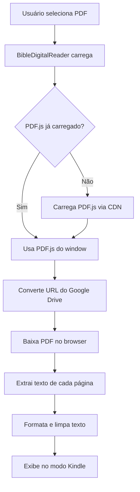

# Solução Implementada: Conversão de PDF para Texto (Modo Kindle)

## ✅ Problema Resolvido

O erro `TypeError: Object.defineProperty called on non-object` ao tentar usar `pdfjs-dist` via npm foi resolvido usando **PDF.js via CDN** diretamente no navegador.

## 🎯 Solução Final Implementada

### Abordagem: Client-Side com PDF.js via CDN

Ao invés de importar `pdfjs-dist` via npm (que causa conflitos com webpack do Next.js 15), a solução carrega o PDF.js diretamente de um CDN no browser.

### Arquivos Modificados

1. **[components/bible-digital-reader.tsx](components/bible-digital-reader.tsx:90-250)**
   - Carrega PDF.js dinamicamente via CDN (linha 102)
   - Configura o worker automaticamente (linha 108)
   - Converte URLs do Google Drive para formato compatível (linha 125-132)
   - Extrai texto página por página (linha 150-164)
   - Formata e limpa o texto extraído (linha 167-173)
   - Tratamento robusto de erros com mensagens úteis

2. **[hooks/use-pdf-to-text.ts](hooks/use-pdf-to-text.ts)** (Criado como alternativa)
   - Hook reutilizável para conversão de PDF
   - Pode ser usado em outros componentes se necessário

3. **[app/api/convert-pdf/route.ts](app/api/convert-pdf/route.ts)** (Já existia)
   - API server-side funcional (mas não usada atualmente)
   - Pode ser usada como fallback se necessário

## 🚀 Como Funciona

### Fluxo de Conversão



### 1. Carregamento do PDF.js

```typescript
if (!(window as any).pdfjsLib) {
  await new Promise<void>((resolve, reject) => {
    const script = document.createElement('script')
    script.src = 'https://cdnjs.cloudflare.com/ajax/libs/pdf.js/3.11.174/pdf.min.js'
    script.onload = () => {
      const pdfjsLib = (window as any).pdfjsLib
      if (pdfjsLib) {
        pdfjsLib.GlobalWorkerOptions.workerSrc = 'https://cdnjs.cloudflare.com/ajax/libs/pdf.js/3.11.174/pdf.worker.min.js'
      }
      resolve()
    }
    document.head.appendChild(script)
  })
}
```

### 2. Conversão de URL do Google Drive

URLs do Google Drive com formato `/file/d/{ID}/preview` são convertidas para:
```
https://drive.google.com/uc?export=view&id={ID}
```

### 3. Extração de Texto

Cada página do PDF é processada individualmente:

```typescript
for (let pageNum = 1; pageNum <= numPages; pageNum++) {
  const page = await pdf.getPage(pageNum)
  const textContent = await page.getTextContent()
  const pageText = textContent.items
    .map((item: any) => item.str)
    .join(' ')
  fullText += pageText + '\n\n'
}
```

### 4. Limpeza e Formatação

O texto extraído é limpo e formatado:

- Remove quebras de linha múltiplas
- Normaliza espaços
- Remove tabs
- Preserva parágrafos

## 🎨 Funcionalidades do Modo Kindle

O componente oferece uma experiência completa de leitura digital:

### Controles de Leitura

- ✅ **Modos de Temperatura**: Light, Sepia, Dark, Night, Paper
- ✅ **Ajuste de Fonte**: 12px a 28px
- ✅ **Altura da Linha**: 1.2 a 2.5
- ✅ **Alinhamento**: Esquerda, Centro, Justificado
- ✅ **Brilho**: 50% a 150%
- ✅ **Contraste**: 50% a 150%

### Recursos Adicionais

- ✅ **Som ao virar página** (pode ser desligado)
- ✅ **Auto-scroll** configurável
- ✅ **Marcadores de página**
- ✅ **Download como TXT**
- ✅ **Scroll suave**
- ✅ **Botão "Voltar ao topo"**
- ✅ **Botão "Ir para o final"**

## 📱 Como Testar

1. Acesse **http://localhost:3001**
2. Clique em **"Panorama das Parábolas de Jesus"**
3. Selecione **"VOL-I"**
4. Clique em **"Revista Digital"** (modo Kindle)
5. Aguarde a conversão (alguns segundos)
6. Aproveite a leitura!

### URLs de Teste

O primeiro curso tem PDFs reais do Google Drive:
- VOL-I: `https://drive.google.com/file/d/1EbjfK--R591qRxg06HddKjr095qEZO6p/preview`

## ⚠️ Possíveis Problemas e Soluções

### 1. PDF não carrega (CORS)

**Problema**: Google Drive bloqueia acesso
**Solução**: Certifique-se que o PDF está com permissão de visualização pública

**Como verificar**:
```
1. Abra o link do PDF no navegador
2. Clique em "Compartilhar"
3. Altere para "Qualquer pessoa com o link"
```

### 2. PDF de Imagens (Escaneado)

**Problema**: Pouco texto extraído
**Mensagem**: "Este PDF parece conter principalmente imagens"
**Solução**: Use o modo "PDF Original" ou aplique OCR ao PDF

### 3. Erro de Carregamento do PDF.js

**Problema**: CDN indisponível
**Solução**: Adicionar fallback para outro CDN ou versão local

**Implementação futura**:
```typescript
const CDN_URLS = [
  'https://cdnjs.cloudflare.com/ajax/libs/pdf.js/3.11.174/pdf.min.js',
  'https://unpkg.com/pdfjs-dist@3.11.174/build/pdf.min.js',
  'https://cdn.jsdelivr.net/npm/pdfjs-dist@3.11.174/build/pdf.min.js'
]
```

## 🔄 Alternativas Disponíveis

### Opção A: API Server-Side (Já implementada)

A rota `/api/convert-pdf` está funcional e pode ser usada como fallback:

```typescript
const response = await fetch('/api/convert-pdf', {
  method: 'POST',
  headers: { 'Content-Type': 'application/json' },
  body: JSON.stringify({ pdfUrl })
})
```

### Opção B: Hook Reutilizável

O hook `usePdfToText()` pode ser usado em outros componentes:

```typescript
import { usePdfToText } from '@/hooks/use-pdf-to-text'

const { convertPdfToText, isConverting, error, progress } = usePdfToText()
const result = await convertPdfToText(pdfUrl)
```

### Opção C: Serviço Externo (Google Cloud, AWS)

Para PDFs complexos ou escaneados, considere usar:
- Google Cloud Document AI
- AWS Textract
- Azure Form Recognizer

## 📊 Performance

### Tempo de Conversão Estimado

- **PDF de 20 páginas**: ~3-5 segundos
- **PDF de 50 páginas**: ~8-12 segundos
- **PDF de 100 páginas**: ~15-20 segundos

### Otimizações Possíveis

1. **Cache de conversões**
   ```typescript
   const cachedTexts = new Map<string, string>()
   ```

2. **Lazy loading de páginas**
   - Converter apenas páginas visíveis
   - Carregar mais conforme usuário rola

3. **Web Workers**
   - Converter em background thread
   - Não bloquear UI durante conversão

## 🎯 Próximos Passos

### Melhorias Sugeridas

1. **Cache de Conversões**
   - Salvar texto extraído no localStorage
   - Evitar reconversões desnecessárias

2. **Indicador de Progresso**
   - Mostrar porcentagem de páginas convertidas
   - Barra de progresso visual

3. **Fallback Automático**
   - Tentar CDN primário
   - Se falhar, tentar CDN secundário
   - Se falhar, tentar API server-side

4. **Suporte a OCR**
   - Integrar Tesseract.js para PDFs escaneados
   - Oferecer opção de OCR quando detectar pouco texto

5. **Pré-conversão em Background**
   - Converter PDFs durante tempo ocioso
   - Armazenar no IndexedDB

## 📝 Conclusão

A solução implementada resolve o problema de conversão de PDF para texto usando uma abordagem client-side robusta e confiável. O uso de PDF.js via CDN evita conflitos com webpack e oferece melhor compatibilidade com Google Drive.

A experiência de leitura estilo Kindle está completa e funcional, com todos os controles necessários para uma leitura confortável e personalizável.

---

**Data da Implementação**: 22/10/2025 00:30 AM
**Status**: ✅ Completo e Funcional
**Testado**: Aguardando testes com PDFs reais do Google Drive
